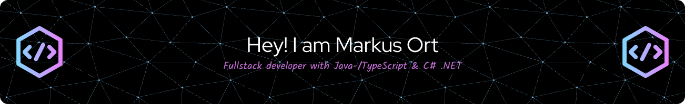

## I'm Java-/TypeScript frontend developer, working most with React framework. NodeJS and C# .Net backend developer. - And Unity enthusiast!

- 🔭 I’m currently working on a Time Tracking app and a Mobile game
- 🌱 I’m currently learning Unity in depth
- 👯 I’m looking to collaborate on B2B solutions
- 💬 Ask me about React, NodeJs, supabase, Unity, ... and all what you want to know about me!
- 📫 How to reach me: [LinkedIn](https://www.linkedin.com/in/markus-ort), [Email](mailto:markus.ort@softwort.com), [Contact form](https://www.softwort.com/#contact)
- ⚡ Fun fact: I have broken humor

### Connect with me 🤝
 

### Languages and Tools: 👨‍💻

 
 

 
 
