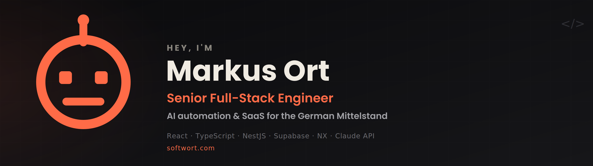

## Senior full-stack developer building AI automation & SaaS for the German Mittelstand — with React, TypeScript, NestJS & Supabase.

- 🤖 **What I do:** I build AI-powered automation and SaaS products that take repetitive admin work off people's desks — DSGVO-compliant, hosted in Frankfurt.
- 🔭 **Currently building:** AI email-triage & CRM automation (~1,200 sales mails/month auto-classified), a scheduling system on Bryntum SchedulerPro for a major transport-sector client, and a multi-language supplier SaaS platform.
- 🧰 **Daily stack:** React · TypeScript · NestJS · Supabase · NX monorepos — plus deep Anthropic Claude API integration.
- 🌱 **Currently going deeper on:** agentic automation, lazy/virtualized data loading at scale, and AI workflows that actually hold up in production.
- 💬 **Ask me about:** React, TypeScript, NestJS, Supabase, NX, Claude API integration, and building automation that survives real-world use.
- 📫 **How to reach me:** [LinkedIn](https://www.linkedin.com/in/markus-ort) · [Email](mailto:markus.ort@softwort.com) · [Contact form](https://www.softwort.com/#contact)
- ⚡ **Fun fact:** my humor compiles — it just throws the occasional unhandled exception.

### Brand: **SoftwOrt** — senior code, not sales-pitch → [softwort.com](https://www.softwort.com) 🤝

 

### Languages and Tools: 👨‍💻

 
 

 
 
